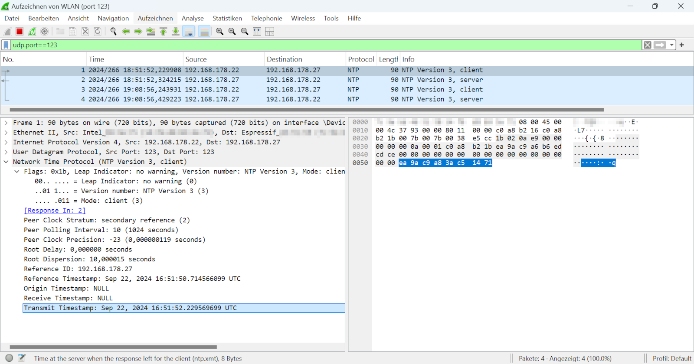

# ntpGPSServer
DIY ESP32 based Stratum 1 NTP server that gets his time from a GPS module and provides NTP to clients via Wifi. The ESP32 can connect to your Wifi  access point, when you set your connection credentials in [secrets.h](ntpGPSServer/secrets.h) or act as an independent Wifi access point, if connection to your Wifi failed. It is a very minimalistic NTP server (Version 3) without fancy stuff like authentication, control messages, cryptographic keys...

Inspired by [ESP32TimeServer](https://github.com/roblatour/ESP32TimeServer/blob/main/Arduino/ESP32TimeServer) by Rob Latour

## License and Copyright

My code is licensed under the terms of the CC0 [Copyright (c) 2024 codingABI](LICENSE).

### External code

Used external libraries from Arduino IDE Library Manager:
- TinyGPS (by Mikal Hart, Version 13.0.0, GPL-3.0 license)

# Appendix

## Hardware
- Microcontroller ESP32 LOLIN32 (other ESP32s should also works)
- GY-NEO6MV2 NEO-6M GPS-Module

## Used development environment 

Arduino IDE 1.8.19 (Without "real portable" support version 2.* makes no sense for me https://forum.arduino.cc/t/arduino-ide-2-0-portable/) 

Board manager: esp32, by Expressif Systems, Version 3.0.5

## External references

- https://www.rfc-editor.org/rfc/rfc5905
- https://www.rfc-editor.org/rfc/rfc1305
- https://tickelton.gitlab.io/articles/ntp-timestamps/
- https://learn.microsoft.com/en-US/windows-server/networking/windows-time-service/how-the-windows-time-service-works

## Network packet samples

### Windows 11 NTP client (IP 192.168.178.22) sends a NTP request to the ntpGPSServer (IP 192.168.178.27)

### The ntpGPSServer (IP 192.168.178.27) sends the NTP response back to the Windows 11 NTP client (IP 192.168.178.22)

### Windows 11 "w32tm /stripchart /computer:..." command
Interestingly, a Windows 11 *w32tm /stripchart  /computer:...* command sends significantly different attributes than a [common Windows 11 NTP client request](#windows-11-ntp-client-ip-19216817822-sends-a-ntp-request-to-the-ntpgpsserver-ip-19216817827):
- UDP-Source port is a highport and not 123
- NTP Version is 1
- reference timestamp (retime) is 0
- Reference ID (refid) is 0
- Root Dispersion (rootdisp) is 0
- Poll is 1s
- Precision is 1s
- Stratum is 0

